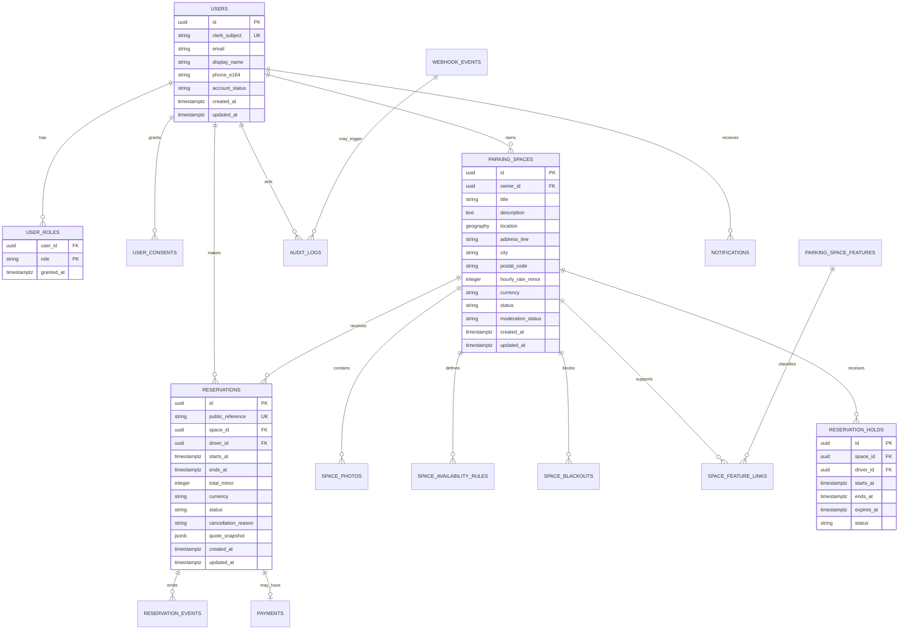

# ParkEn — Production MVP Architecture

**Product:** ParkEn  
**Tagline:** Find. Reserve. Park.  
**Document status:** Architecture only — no application implementation is defined here.  
**Target audience:** Product, frontend, backend, data, DevOps, and security contributors.

## 0. Architecture summary

ParkEn is a two-sided parking marketplace:

> **Implementation override:** The original architecture recommended Clerk-managed
> identity. The current backend implementation follows the explicit build
> requirement for JWT authentication using an HS256 access token and Argon2
> password hashing. This is the active backend contract until a future auth
> migration is requested.

- **Drivers** search for nearby parking, inspect availability and pricing, and reserve a space.
- **Parking owners** publish and manage spaces, pricing, operating hours, and reservations.
- **Operations users** moderate listings, resolve incidents, and audit reservations.

The MVP is a modular monorepo with a browser application, a Python API, a relational geospatial database, and a small asynchronous worker tier.

```text
Browser
  │
  ├── Next.js 15 web app
  │     ├── Clerk session / route protection
  │     ├── Mapbox GL JS map
  │     └── generated TypeScript API client
  │
  └── FastAPI API
        ├── Clerk JWT verification
        ├── domain services and authorization
        ├── SQLAlchemy 2 + PostgreSQL/PostGIS
        ├── Redis for short-lived holds, rate limits, and jobs
        ├── Mapbox server-side geocoding / routing
        ├── Gemini via Replit AI Integrations
        └── worker for notifications and asynchronous jobs
```

### Architectural principles

1. **Reservation correctness over convenience.** Availability is enforced by PostgreSQL constraints and transactional service logic, not only by UI checks.
2. **Identity belongs to Clerk.** ParkEn stores a stable Clerk subject and application profile data; it does not implement passwords, local login, or a second token system.
3. **The API is the business boundary.** The browser never talks directly to PostgreSQL, Redis, Mapbox server APIs, or Gemini.
4. **Geospatial search is first-class.** Use PostGIS for distance and bounding-box queries; use Mapbox for address resolution, map tiles, and route estimates.
5. **Every write is auditable.** Reservation, listing, moderation, and role changes emit an audit event.
6. **External services are replaceable adapters.** Mapbox, Gemini, Clerk, email, and future payments sit behind integration interfaces.
7. **MVP scope stays narrow.** One parking space per listing is the initial booking unit; multi-space inventory and dynamic pricing are later extensions.

## 1. Complete target folder structure

This is the intended implementation layout. The existing workspace scaffold is intentionally not changed during the architecture phase.

```text
parken/
├── apps/
│   └── web/                                   # Next.js 15 + TypeScript + Tailwind + shadcn/ui
│       ├── app/
│       │   ├── (marketing)/
│       │   │   ├── page.tsx                    # Public landing/search entry
│       │   │   └── how-it-works/page.tsx
│       │   ├── (auth)/
│       │   │   ├── sign-in/[[...sign-in]]/page.tsx
│       │   │   └── sign-up/[[...sign-up]]/page.tsx
│       │   ├── (driver)/
│       │   │   ├── search/page.tsx              # Map + search results
│       │   │   ├── spaces/[spaceId]/page.tsx
│       │   │   ├── checkout/[spaceId]/page.tsx
│       │   │   ├── reservations/page.tsx
│       │   │   └── reservations/[reservationId]/page.tsx
│       │   ├── (owner)/
│       │   │   ├── owner/page.tsx
│       │   │   ├── owner/spaces/page.tsx
│       │   │   ├── owner/spaces/new/page.tsx
│       │   │   ├── owner/spaces/[spaceId]/edit/page.tsx
│       │   │   └── owner/reservations/page.tsx
│       │   ├── (admin)/
│       │   │   ├── admin/page.tsx
│       │   │   ├── admin/listings/page.tsx
│       │   │   ├── admin/reservations/page.tsx
│       │   │   └── admin/audit/page.tsx
│       │   ├── api/                             # Next-only browser-facing adapters when needed
│       │   ├── layout.tsx
│       │   ├── not-found.tsx
│       │   ├── error.tsx
│       │   └── loading.tsx
│       ├── components/
│       │   ├── layout/                          # Navigation, shell, responsive containers
│       │   ├── map/                             # Mapbox map, markers, bounds, controls
│       │   ├── spaces/                           # Search, detail, availability, listing forms
│       │   ├── reservations/                     # Quote, confirmation, status, cancellation
│       │   ├── owner/                            # Owner workflows
│       │   ├── admin/                            # Moderation and operations workflows
│       │   └── ui/                               # shadcn/ui primitives only
│       ├── features/
│       │   ├── auth/
│       │   ├── search/
│       │   ├── reservations/
│       │   ├── listings/
│       │   └── ai-assistant/
│       ├── lib/
│       │   ├── api/                              # Generated client wrapper and error mapping
│       │   ├── auth/
│       │   ├── mapbox/
│       │   ├── query/
│       │   ├── analytics/
│       │   └── utils/
│       ├── styles/
│       │   ├── globals.css
│       │   └── tokens.css
│       ├── public/
│       │   ├── icons/
│       │   └── images/
│       ├── middleware.ts                         # Clerk protection and route policy
│       ├── next.config.ts
│       ├── tailwind.config.ts
│       ├── components.json
│       ├── package.json
│       └── tsconfig.json
│
├── services/
│   └── api/                                     # FastAPI service
│       ├── app/
│       │   ├── main.py                          # App factory and lifespan
│       │   ├── config.py                        # Typed settings
│       │   ├── dependencies.py                  # DB, auth, request context
│       │   ├── api/
│       │   │   ├── router.py                    # /api/v1 router
│       │   │   └── v1/
│       │   │       ├── health.py
│       │   │       ├── auth.py
│       │   │       ├── users.py
│       │   │       ├── spaces.py
│       │   │       ├── availability.py
│       │   │       ├── reservations.py
│       │   │       ├── owner.py
│       │   │       ├── admin.py
│       │   │       ├── ai.py
│       │   │       └── webhooks.py
│       │   ├── domain/
│       │   │   ├── users/
│       │   │   ├── spaces/
│       │   │   ├── reservations/
│       │   │   └── moderation/
│       │   ├── models/                           # SQLAlchemy ORM models
│       │   ├── schemas/                          # Pydantic request/response schemas
│       │   ├── repositories/                     # Persistence queries only
│       │   ├── services/                         # Transactional business workflows
│       │   ├── policies/                         # RBAC and ownership checks
│       │   ├── integrations/
│       │   │   ├── clerk/
│       │   │   ├── mapbox/
│       │   │   ├── gemini/
│       │   │   └── notifications/
│       │   ├── db/
│       │   │   ├── session.py
│       │   │   ├── base.py
│       │   │   └── migrations/
│       │   ├── workers/
│       │   │   ├── queue.py
│       │   │   └── jobs/
│       │   └── observability/
│       │       ├── logging.py
│       │       ├── metrics.py
│       │       └── tracing.py
│       ├── tests/
│       │   ├── unit/
│       │   ├── integration/
│       │   └── contract/
│       ├── alembic.ini
│       ├── pyproject.toml
│       └── Dockerfile
│
├── packages/
│   ├── contracts/                               # OpenAPI snapshot and generated TS types
│   │   ├── openapi.yaml
│   │   ├── generated/
│   │   └── package.json
│   ├── ui/                                      # Shared shadcn/ui composition primitives
│   ├── config/                                  # Shared TypeScript / lint / formatting config
│   └── analytics/                               # Event names and typed client helpers
│
├── infra/
│   ├── docker/
│   │   ├── docker-compose.dev.yml
│   │   └── docker-compose.ci.yml
│   ├── postgres/
│   │   └── init/
│   ├── nginx/
│   │   └── nginx.conf                           # Optional self-hosted edge
│   └── observability/
│       ├── otel-collector.yml
│       └── dashboards/
│
├── docs/
│   ├── park-en-architecture.md
│   └── park-en-er-diagram.mmd
├── .env.example
├── .gitignore
├── docker-compose.yml                            # Thin pointer to infra compose
├── pnpm-workspace.yaml
├── package.json
└── README.md
```

### Boundary rules

- `apps/web` may depend on `packages/contracts`, `packages/ui`, and `packages/analytics`.
- `services/api` owns all database access and domain decisions.
- `packages/contracts` is generated from the FastAPI OpenAPI document after API routes are implemented; it is not a second business-logic source.
- `domain` code must not import FastAPI request objects.
- `repositories` must not make authorization decisions.
- `services` must not read raw request headers; auth context is injected by dependencies.
- External clients are created through adapters and are never called from route modules directly.

## 2. Database architecture

### Database choice

- **PostgreSQL 16+ with PostGIS 3.x**
- **SQLAlchemy 2.x async ORM**
- **Alembic** for versioned migrations
- **pgBouncer** in production where the hosting provider supports it
- UTC for all timestamps; `timestamptz` in PostgreSQL
- UUID primary keys generated application-side or by PostgreSQL

### Core tables

#### Identity and access

- `users`: ParkEn profile keyed by Clerk `subject`; display name, phone verification state, account status, timestamps.
- `user_roles`: many-to-many role assignments; role values are `driver`, `owner`, `support`, `admin`.
- `user_consents`: terms, privacy, marketing, and timestamped consent versions.

#### Parking inventory

- `parking_spaces`: the booking unit; owner, title, description, address snapshot, `geography(Point, 4326)`, vehicle constraints, pricing, listing status, moderation state.
- `parking_space_features`: normalized feature catalog (`covered`, `ev_charging`, `security_camera`, `accessible`, etc.).
- `parking_space_feature_links`: many-to-many relation between spaces and features.
- `space_photos`: object-storage keys, ordering, alt text, moderation state.
- `space_availability_rules`: recurring weekly rules and exceptional date overrides.
- `space_blackouts`: owner-created unavailable periods.

#### Booking

- `reservation_holds`: short-lived server-side holds during checkout; unique token hash, expiry, requested interval, and state.
- `reservations`: confirmed or terminal booking records; immutable quote snapshot, time range, status, cancellation metadata, and public reference.
- `reservation_events`: append-only lifecycle events for audit and support.
- `payments`: reserved for the payment phase; stores provider references and state transitions without card data.

#### Operations and integrations

- `audit_logs`: actor, action, entity, before/after JSON snapshots, request ID, and timestamp.
- `webhook_events`: provider event ID, provider name, payload hash, received/processed timestamps, processing status, and retry count.
- `notifications`: in-app/email notification intent and delivery state.

### Important database constraints

1. `users.clerk_subject` is unique and immutable.
2. A `parking_space` must have one owner and cannot be deleted after a reservation; use archival status.
3. Latitude/longitude is stored in PostGIS geography; address text is a display snapshot, not the geospatial source of truth.
4. A confirmed reservation must satisfy `starts_at < ends_at`.
5. Confirmed reservations for the same space must not overlap. Enforce this with a PostgreSQL exclusion constraint on a `tstzrange(starts_at, ends_at, '[)')` using GiST, excluding cancelled and expired rows.
6. A hold is unique per space and interval while active; Redis is the fast path, PostgreSQL is the recovery/audit path.
7. Money is stored as integer minor units plus ISO currency, never floating point.
8. Provider event IDs are unique per provider for webhook idempotency.
9. PII columns are minimized; no card number, secret, or Clerk token is stored.
10. Every mutable aggregate includes `created_at`, `updated_at`, and an optional `version` for optimistic concurrency.

### Search indexes

- GiST index on `parking_spaces.location`.
- B-tree indexes on `(status, moderation_status)`, `owner_id`, and `city`.
- Partial GiST exclusion index for active reservations.
- GIN index only for carefully selected JSONB fields; prefer typed columns for search filters.
- Full-text search can be added later; MVP search is geospatial plus structured filters.

### Reservation transaction

The reservation service runs one database transaction:

1. Validate authenticated driver and request idempotency key.
2. Lock the space row or read it under a consistent isolation level.
3. Re-check listing status, operating hours, blackouts, and current price.
4. Verify the requested interval does not conflict with a hold or confirmed reservation.
5. Insert the reservation or convert a valid hold.
6. Let the database exclusion constraint be the final race-condition guard.
7. Write a reservation event and audit log.
8. Commit before enqueueing notifications.

## 3. ER diagram

The canonical Mermaid source is in [`docs/park-en-er-diagram.mmd`](./park-en-er-diagram.mmd).



## 4. API architecture

### API conventions

- REST/JSON over HTTPS.
- Base path: `/api/v1`.
- OpenAPI generated by FastAPI and committed as a contract snapshot.
- Pydantic models define request and response shapes.
- Errors use `application/problem+json` with `type`, `title`, `status`, `detail`, and `request_id`.
- Cursor pagination for collections: `limit`, `cursor`, `next_cursor`.
- All mutation endpoints accept `Idempotency-Key` where retries could create a duplicate.
- Every response includes or can be correlated to `X-Request-ID`.
- Dates are ISO 8601 with timezone; all server comparisons use UTC.
- API never returns secrets, raw provider payloads, or internal stack traces.

### Endpoint groups

#### Health and metadata

```text
GET  /api/v1/health/live
GET  /api/v1/health/ready
GET  /api/v1/meta
```

#### Authentication and profile

```text
GET  /api/v1/me
PATCH /api/v1/me
GET  /api/v1/me/roles
POST /api/v1/webhooks/clerk
```

#### Parking search and details

```text
GET  /api/v1/spaces
GET  /api/v1/spaces/{space_id}
GET  /api/v1/spaces/{space_id}/availability
GET  /api/v1/spaces/{space_id}/quote
```

`GET /spaces` supports:

```text
lat, lng, radius_m
bbox
starts_at, ends_at
min_hourly_rate, max_hourly_rate
features[]
vehicle_type
sort=distance|price|availability
limit, cursor
```

#### Driver reservations

```text
POST /api/v1/reservation-holds
DELETE /api/v1/reservation-holds/{hold_id}
POST /api/v1/reservations
GET  /api/v1/reservations
GET  /api/v1/reservations/{reservation_id}
POST /api/v1/reservations/{reservation_id}/cancel
```

#### Owner workflows

```text
GET  /api/v1/owner/spaces
POST /api/v1/owner/spaces
GET  /api/v1/owner/spaces/{space_id}
PATCH /api/v1/owner/spaces/{space_id}
POST /api/v1/owner/spaces/{space_id}/submit-review
POST /api/v1/owner/spaces/{space_id}/blackouts
GET  /api/v1/owner/reservations
```

#### Admin and support

```text
GET  /api/v1/admin/spaces
POST /api/v1/admin/spaces/{space_id}/approve
POST /api/v1/admin/spaces/{space_id}/reject
GET  /api/v1/admin/reservations
GET  /api/v1/admin/audit-logs
POST /api/v1/admin/users/{user_id}/suspend
```

#### AI assistance

```text
POST /api/v1/ai/parking-assistant
```

The assistant is constrained to ParkEn search, parking guidance, and the authenticated user's visible data. It must not confirm a reservation, change a listing, or expose private data. Gemini receives minimized context and structured tool results rather than unrestricted database access.

#### Mapbox adapter boundaries

- Browser Mapbox token is restricted by allowed origins and public map scopes.
- FastAPI calls Mapbox only for geocoding, reverse geocoding, and optional route estimates.
- Mapbox failures degrade address enrichment and route estimates, not reservation correctness.
- Search uses PostGIS after the request has been normalized; it does not proxy every map interaction through FastAPI.

### Request flow: search

1. Browser requests `/spaces` with viewport or radius filters.
2. FastAPI validates and normalizes coordinates and dates.
3. Repository executes PostGIS query with availability filters.
4. Service applies visibility and moderation policy.
5. API returns compact result cards plus a detail URL.
6. Browser renders markers and list results; Mapbox renders tiles separately.

### Request flow: reserve

1. Clerk-authenticated browser requests a quote.
2. API returns a server-calculated quote with expiry.
3. Browser optionally creates a short hold.
4. `POST /reservations` requires an idempotency key.
5. API executes the transactional reservation flow described above.
6. Worker sends confirmation notification after commit.

## 5. Authentication and authorization architecture

### Identity provider

The current backend uses application-managed JWT authentication for sign-up,
sign-in, and protected API access. Passwords are hashed with Argon2 through
`pwdlib`; raw passwords are never stored. Access tokens are short-lived HS256
JWTs signed with `JWT_SECRET` (falling back to the managed `SESSION_SECRET`).

The previous architecture recommended **Clerk managed authentication**. That
recommendation is superseded for this implementation because JWT authentication
was explicitly requested.

The application stores:

- Clerk `sub` as the immutable `users.clerk_subject`.
- A local profile for domain fields and operational status.
- Local role assignments because ParkEn authorization is domain-specific.

The application does **not** store plaintext passwords, refresh tokens, or session cookies. It does issue short-lived access JWTs as required by the current backend contract.

### Web flow

1. Next.js loads Clerk provider and middleware.
2. Public routes are available without a session.
3. Driver, owner, and admin route groups require a Clerk session.
4. Browser requests include Clerk's session token through the approved client/server integration.
5. FastAPI validates the bearer token against Clerk's issuer and JWKS, including issuer, audience, expiry, and subject.
6. API loads the local user by Clerk subject and creates the profile on first authenticated access if allowed by policy.

### Webhook synchronization

- Clerk user-created, user-updated, and user-deleted events are verified by signature.
- `webhook_events` makes processing idempotent.
- User deletion is translated into account deactivation/anonymization rules; reservations and audit records remain for operational integrity.

### Authorization layers

1. **Authentication:** valid Clerk token.
2. **Role authorization:** role required by endpoint.
3. **Ownership authorization:** owner can access only owned spaces and related records.
4. **Resource visibility:** only approved and active spaces are public.
5. **State authorization:** transitions follow a finite-state policy; clients cannot set arbitrary status values.
6. **Operational authorization:** admin and support actions are audited and restricted by role.

### Security controls

- HTTPS only outside local development.
- Short-lived bearer tokens; no token persistence in local storage.
- CORS allowlist for the web origin.
- CSRF protection for cookie-backed browser mutations if a same-origin session adapter is introduced.
- Rate limits for sign-in-adjacent endpoints, search, holds, reservations, AI, and webhooks.
- Redact authorization headers and PII from logs.
- Verify webhooks before parsing business payloads.
- Never place `CLERK_SECRET_KEY`, Mapbox server token, or Gemini credentials in client bundles.

## 6. User roles

| Role | Primary capabilities | Restrictions |
|---|---|---|
| `driver` | Search public spaces, request quotes, create/cancel own reservations, view own history | Cannot publish inventory or access another user's data |
| `owner` | Create and edit owned spaces, manage hours/blackouts, view reservations for owned spaces | Cannot approve own listing or alter another owner's space |
| `support` | View customer and reservation context, assist with operational resolution, add internal notes | No role management; no destructive data deletion |
| `admin` | Approve/reject listings, suspend accounts, manage roles, inspect audit logs, resolve escalations | All privileged actions require audit records |

Users may hold multiple roles (`driver` + `owner`). The effective permissions are the union of granted roles, subject to resource ownership and state rules.

### Listing state machine

```text
draft → pending_review → approved → active → paused → archived
                      └→ rejected → draft
```

### Reservation state machine

```text
held → confirmed → active → completed
  └→ expired
confirmed → cancelled
active    → cancelled_by_support
```

Transitions are performed by domain services, never by direct generic PATCH operations.

## 7. Docker architecture

### Local development topology

```text
docker compose
├── web        Next.js development server
├── api        FastAPI + Uvicorn
├── worker     FastAPI worker process / job consumer
├── postgres   PostgreSQL + PostGIS
├── redis      Holds, rate limits, queues, cache
└── mailpit    Local email capture
```

Mapbox, Clerk, and Gemini remain external services. Local development uses their development credentials or Replit-managed AI integration configuration; no provider is emulated in the database container.

### Production topology

```text
CDN / edge
  ├── Next.js web runtime
  └── FastAPI API runtime
        ├── managed PostgreSQL + PostGIS
        ├── managed Redis
        ├── worker process
        └── logs / metrics / traces
```

### Container rules

- Multi-stage builds with non-root runtime users.
- Pinned base image families and dependency lockfiles.
- Read-only root filesystem where the platform permits it.
- Healthchecks for API, worker, PostgreSQL, and Redis.
- No secrets baked into images or committed compose files.
- API and worker share the same application image but use different commands.
- Database migrations run as an explicit release step, never implicitly on every container boot.
- Images are scanned before promotion.

### Scaling expectations

- Web scales horizontally and remains stateless.
- API scales horizontally; all reservation truth is in PostgreSQL.
- Worker scales independently by queue depth.
- Redis is not the source of truth for bookings; losing Redis must not create duplicate reservations.
- Postgres read replicas are a later optimization, not an MVP dependency.

## 8. Environment variables

The following is the contract for configuration. Values belong in Replit Secrets or the deployment platform's secret manager; never commit real values.

### Web — public/runtime-safe

```text
NEXT_PUBLIC_APP_URL
NEXT_PUBLIC_CLERK_PUBLISHABLE_KEY
NEXT_PUBLIC_MAPBOX_TOKEN
NEXT_PUBLIC_API_BASE_URL
NEXT_PUBLIC_ANALYTICS_ENABLED
```

### API — server-only

```text
APP_ENV=development|staging|production
APP_NAME=ParkEn
LOG_LEVEL=INFO
API_PREFIX=/api/v1

DATABASE_URL
DATABASE_POOL_SIZE
DATABASE_MAX_OVERFLOW
REDIS_URL

CLERK_ISSUER_URL
CLERK_JWKS_URL
CLERK_AUDIENCE
CLERK_SECRET_KEY

MAPBOX_ACCESS_TOKEN
MAPBOX_GEOCODING_BASE_URL

AI_INTEGRATIONS_GEMINI_BASE_URL
AI_INTEGRATIONS_GEMINI_API_KEY
GEMINI_MODEL=gemini-3-flash-preview

CORS_ORIGINS
TRUSTED_HOSTS
RATE_LIMIT_ENABLED
RATE_LIMIT_REQUESTS_PER_MINUTE

SENTRY_DSN
OTEL_EXPORTER_OTLP_ENDPOINT
REQUEST_LOG_SALT
```

### Worker — server-only

```text
DATABASE_URL
REDIS_URL
CLERK_ISSUER_URL
NOTIFICATION_PROVIDER
EMAIL_FROM_ADDRESS
SENTRY_DSN
```

### Configuration rules

- `NEXT_PUBLIC_*` values are considered public and must not contain secrets.
- `DATABASE_URL`, provider server tokens, signing keys, and API credentials are secret values.
- Gemini should use Replit AI Integrations; this provisions `AI_INTEGRATIONS_GEMINI_BASE_URL` and `AI_INTEGRATIONS_GEMINI_API_KEY` without asking the user to paste a key.
- Environment validation fails fast at service startup for required values.
- Development, staging, and production use separate Clerk instances/configuration and separate databases.

## 9. Development roadmap

### Phase 0 — Architecture and repository foundation

- Approve this architecture and MVP boundaries.
- Create the Next.js/FastAPI monorepo layout.
- Establish Python dependency management, pnpm workspace rules, formatting, linting, and CI.
- Define API versioning and OpenAPI generation workflow.
- Configure environment validation and secret handling.

### Phase 1 — Identity and profiles

- Configure Clerk.
- Implement verified JWT dependency in FastAPI.
- Add user synchronization webhook.
- Add driver/owner onboarding and role assignment policy.
- Add protected route groups and baseline audit logging.

### Phase 2 — Parking inventory

- Add PostGIS database and Alembic migrations.
- Implement owner space CRUD.
- Implement photos through object storage abstraction.
- Implement weekly availability, blackouts, moderation workflow, and admin review.
- Integrate Mapbox address search and reverse geocoding.

### Phase 3 — Search and discovery

- Implement radius and bounding-box search.
- Add date/time availability filtering.
- Add structured filters and sorting.
- Build map/list synchronization, space detail, and availability presentation.
- Add observability around search latency and Mapbox failures.

### Phase 4 — Reservation core

- Implement quote calculation.
- Add Redis-backed short-lived holds with PostgreSQL recovery/audit records.
- Add reservation transaction and exclusion constraint.
- Add idempotency keys and reservation state machine.
- Add driver and owner reservation views.
- Add confirmation and cancellation notifications.

### Phase 5 — Gemini assistant

- Provision Replit AI Integrations for Gemini.
- Add narrow parking assistant endpoint.
- Ground responses with API-provided space and reservation context.
- Add rate limits, prompt/version logging without sensitive content, and fallback behavior.
- Keep reservation mutations outside model authority.

### Phase 6 — Operational readiness

- Add support tools and audit log search.
- Add structured logs, metrics, tracing, and error reporting.
- Add backup/restore rehearsal and migration rollback procedure.
- Add security headers, dependency scanning, abuse/rate-limit review, and data retention policy.
- Run load tests for search and reservation contention.

### Phase 7 — Payments and post-MVP expansion

- Add payment provider only after the reservation lifecycle is stable.
- Introduce `payments` transitions, refunds, receipts, and webhook reconciliation.
- Add multi-space lots, dynamic pricing, reviews, promotions, and advanced owner analytics.

### MVP release gates

- No overlapping confirmed reservations under concurrent requests.
- All privileged actions appear in audit logs.
- Search remains usable when Mapbox enrichment is unavailable.
- Reservation flow remains correct when Redis is unavailable or restarted.
- Clerk webhook replay is idempotent.
- Secrets are absent from client bundles, logs, images, and version control.
- Database restore and migration procedures are documented and rehearsed.

## Explicit non-goals for the first implementation

- No local password authentication.
- No direct client-to-database access.
- No payment capture until the reservation state machine is proven.
- No arbitrary AI agent actions against production data.
- No multi-tenant enterprise organization model in the first MVP.
- No hard delete for spaces, users, reservations, or audit records.
